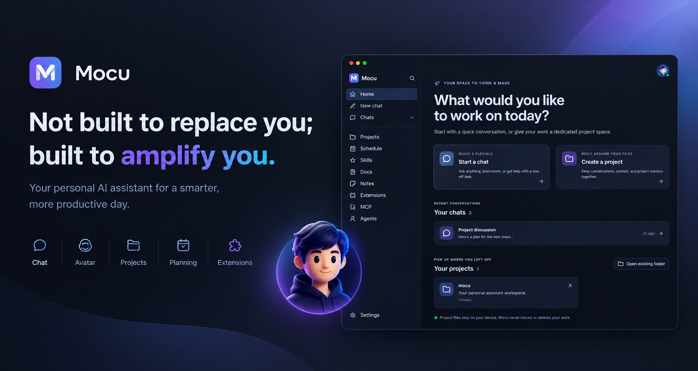

# Mocu — توان بیشتر، همچنان خودِ شما

**زبان‌ها:** [English](README.md) · [فارسی](README.fa.md)

<p align="center">
  
</p>

<p align="center">
  
  
  
</p>

> **مکو برای جایگزین شدن با شما ساخته نشده؛ برای بیشتر کردن توان شما ساخته شده است.**

ایده‌ها، قضاوت و هدف‌هایتان همچنان در مرکز کار باقی می‌مانند. مکو ایجنت‌های هوش مصنوعی شخصی، ابزارها، دانش و حافظه را کنار هم می‌آورد تا بهره‌وری‌تان بیشتر شود و کارها را پیش ببرید—نه اینکه نقش خودتان را به هوش مصنوعی واگذار کنید.

تیمی از هوش مصنوعی بسازید که با شیوهٔ کار **شما** هماهنگ باشد. روش‌هایتان را به آن یاد بدهید و ابزارها و دانش به‌روز لازم را در اختیارش بگذارید. سپس از یک کار فوری تا پروژه‌ای بلندمدت، در یک فضای کاری دسکتاپ با آن همکاری کنید.

**[دریافت نسخهٔ ویندوز](https://github.com/kharchangai/Mocu/releases) · [ساخت از روی کد منبع](#ساخت-از-روی-کد-منبع) · [گزارش اشکال](https://github.com/kharchangai/Mocu/issues)**

> **انتشار آلفا:** مکو همچنان در حال توسعه است. ممکن است اشکال، قابلیت‌های ناتمام یا تغییرات ناسازگار وجود داشته باشد. از کارهای مهم نسخهٔ پشتیبان تهیه کنید و پیش از اتکا به خروجی‌ها و اقدام‌های هوش مصنوعی، آن‌ها را بررسی کنید.

---

## تیم هوش مصنوعی خودتان را بسازید—بدون نیاز به برنامه‌نویسی

یک دستیار عمومی نمی‌داند شما می‌خواهید هر کاری دقیقاً به چه روشی انجام شود. در مکو می‌توانید فقط با توضیح نیازتان به زبان طبیعی، **ایجنت‌های متخصص و شخصی‌سازی‌شده** بسازید.

> «یک ایجنت پژوهش بساز که از اسناد مرجع من استفاده کند، یک ایجنت نویسندگی که از سبک من پیروی کند و یک بازبین که نتیجه را بررسی کند. از نویسنده بخواه پژوهش و بازبینی را به آن دو واگذار کند.»

هر ایجنت می‌تواند دستورالعمل‌ها، ابزارها، اسکیل‌ها، اکستنشن‌ها، مدل و ایجنت‌های فرعی خودش را داشته باشد. با یک متخصص مفید شروع کنید و با رشد نیازهایتان، ایجنت‌ها را به سیستم‌های پیشرفته‌تری وصل کنید—بدون اینکه لازم باشد تعریفشان را دستی کدنویسی کنید.

- **شخصی‌سازی کنید:** نقش، سبک کار و ابزارهای مجاز هر ایجنت را مشخص کنید.
- **سیستم‌های قابل استفادهٔ مجدد بسازید:** متخصص‌ها را کنار هم بگذارید و واگذاری کار به ایجنت‌های دیگر را ممکن کنید.
- **هر وقت نیاز داشتید از آن‌ها استفاده کنید:** یک ایجنت ذخیره‌شده را با دستور `/agent` انتخاب کنید یا به زبان ساده از مکو بخواهید کاری را واگذار کند.
- **به‌مرور بهبودشان دهید:** با تغییر روند کارتان، از مکو بخواهید ایجنت را به‌روزرسانی کند.

این‌ها دستیارهای قابل استفادهٔ مجدد شما هستند که برای مسئولیت‌هایتان ساخته شده‌اند، نه یک شخصیت هوش مصنوعی یکسان برای همه. ایجنت‌ها هنگام فراخوانی اجرا می‌شوند؛ اجرای زمان‌بندی‌شده هم امکان خودکارسازی کارهای مشخص را در زمان دلخواه شما می‌دهد.

## مکو را متناسب با نیازهایتان گسترش دهید

روند کارتان نباید به قابلیت‌های ازپیش‌ساختهٔ یک برنامه محدود شود. **اکستنشن‌ها ابزارها و یکپارچه‌سازی‌های تازه‌ای اضافه می‌کنند** تا مکو همراه با نیازهای کاری شما رشد کند.

اکستنشن‌های همراه برنامه را از صفحهٔ Extensions نصب کنید یا یک اکستنشن را از پوشه یا فایل ZIP اضافه کنید. برای استفاده از اکستنشن‌ها در یک درخواست، آن‌ها را با دستور `/extension` انتخاب کنید. نصب به‌تنهایی اکستنشن را در گفت‌وگو فعال نمی‌کند.

**لازم نیست خودتان کدنویسی کنید.** قابلیت موردنظرتان را توضیح دهید و از مکو بخواهید در ساخت اکستنشن سفارشی، از جمله کد و بسته‌بندی آن، کمک کند. این روند توسعه با کمک هوش مصنوعی انجام می‌شود: اکستنشن‌های تولیدشده همچنان باید آزمایش شوند و یکپارچه‌سازی‌ها ممکن است به کلید API، مجوز یا سرویس خارجی نیاز داشته باشند. این قابلیت تضمین نمی‌کند که هر یکپارچه‌سازی با یک کلیک کار کند.

در پشت صحنه، اکستنشن‌ها به شکل برنامه‌های Node.js یا Python اجرا می‌شوند. توسعه‌دهندگان می‌توانند با SDKهای همراه برنامه نیز اکستنشن بسازند و پشتیبانی MCP راه دیگری برای اتصال ابزارهای خارجی فراهم می‌کند.

### ایجنت‌ها + اسکیل‌ها + اکستنشن‌ها = روند کاری هوشمند خودتان

| جزء | چه چیزی اضافه می‌کند؟ |
|---|---|
| **ایجنت‌ها** | چه کسی کار را انجام می‌دهد: متخصص‌هایی با نقش، ابزار و قابلیت واگذاری کار. |
| **اسکیل‌ها** | کار باید چگونه انجام شود: دستورالعمل‌ها و روش‌های قابل استفادهٔ مجدد. |
| **اکستنشن‌ها** | سیستم چه کارهایی می‌تواند انجام دهد: ابزارها و یکپارچه‌سازی‌های تازه. |

این اجزا در کنار هم به شما امکان می‌دهند بدون نیاز به برنامه‌نویسی، روندهای کاری پیچیدهٔ هوش مصنوعی بسازید. پیچیدگی می‌تواند در سیستمی باشد که می‌سازید، نه در دستورهایی که هر روز تکرار می‌کنید.

برای نمونه، یک روند تولید محتوا می‌تواند ایجنت پژوهش، نویسنده و بازبین را با یک اسکیل برای فرایند ویرایش شما و اکستنشن ابزارهای انتشار ترکیب کند. اسناد شما اطلاعات به‌روز محصول را فراهم می‌کنند و نوت‌ها اولویت‌های شخصی‌تان را یادآوری می‌کنند.

## دانش به‌روز در اختیار ایجنت‌هایتان بگذارید—نه فقط دانش زمان آموزش مدل

مدل‌ها به‌طور خودکار از آخرین تغییرات محصول، فرایندهای داخلی یا قراردادهای پروژهٔ شما باخبر نمی‌شوند. **اسناد دانش مکو (Mocu Docs)** به شما امکان می‌دهند این اطلاعات را در اختیارشان بگذارید و به‌روز نگه دارید.

مطالب مرجع، دستورالعمل‌ها، اطلاعات محصول یا راهنماها را به‌صورت اسناد دانشِ قابل جست‌وجو ذخیره کنید. مکو برای درخواست فعلی، ارجاع‌های مرتبط به اسناد را پیدا می‌کند و هرگاه به جزئیات نیاز داشته باشد، متن کامل آن‌ها را می‌خواند.

- **دانش را به‌روز نگه دارید:** با تغییر کارهایتان، اسناد را به‌روزرسانی کنید.
- **به ایجنت‌ها زمینه بدهید:** قواعد، واقعیت‌ها و روش‌هایی را در اختیارشان بگذارید که برای فهم کار نیاز دارند.
- **از چسباندن مکرر اطلاعات زمینه‌ای پرهیز کنید:** دانش مفید را در گفت‌وگوهای مختلف در دسترس قرار دهید.
- **بدون راه‌اندازی جداگانهٔ RAG شروع کنید:** به‌جای سرهم‌کردن یک سامانهٔ بازیابی خارجی، از روند دانشِ داخلی مکو استفاده کنید.

این همچنان یک سامانهٔ بازیابی اطلاعات است: از جست‌وجوی کلیدواژه‌ای و معنایی، همراه با رتبه‌بندی دوبارهٔ اختیاری Jev، استفاده می‌کند و متن اسناد را هنگام نیاز می‌خواند. مدل را دوباره آموزش نمی‌دهد و اطلاعاتی را که به‌روزرسانی نکرده‌اید خودکار تازه نمی‌کند.

## نوت‌هایی که خواسته‌هایتان را به گفت‌وگو برمی‌گردانند

همه‌چیز به یک سند کامل نیاز ندارد. **نوت‌ها** برای چیزهای مهمی هستند که می‌خواهید دم دستتان بمانند: ترجیحات، تصمیم‌ها، برنامه‌ها و چیزهایی که نمی‌خواهید فراموش کنید.

> «یادت باشد: پیش از انتشار اطلاعیهٔ نسخهٔ جدید، تصویرهای صفحه را به‌روزرسانی کنم و پیوند دانلود را بررسی کنم.»

نوت‌ها **دقیقاً همان‌طور که می‌نویسید** ذخیره می‌شوند. وقتی گفت‌وگویی به موضوعی مرتبط باشد، مکو می‌تواند نوت‌های مناسب را پیدا کند و از آن‌ها استفاده کند تا خواسته‌هایتان را در نظر بگیرد یا هنگام کمک به انجام کار، آن‌ها را به شما یادآوری کند.

برای دانش مرجع ساختارمند از **Docs** استفاده کنید؛ برای زمینه و خواسته‌های شخصی از **Notes**. اگر یادآوری را برای زمان مشخصی می‌خواهید، از **Schedule** استفاده کنید.

## روزتان را برنامه‌ریزی کنید و اجرای ایجنت‌ها را زمان‌بندی کنید

سامانهٔ زمان‌بندی مکو هم یادآوری‌های روزمره و هم **اجرای خودکار ایجنت‌های ذخیره‌شده** را پشتیبانی می‌کند.

- برای جلسه، مهلت یا کار، یادآوری تنظیم کنید.
- برای یک ایجنت متخصص، با دستورالعمل و در تاریخ و ساعت دلخواهتان اجرا زمان‌بندی کنید.
- یادآوری‌ها یا اجرای ایجنت‌ها را روزانه، هفتگی یا ماهانه تکرار کنید.
- زمان‌بندی‌ها و اجراهای گذشته را از صفحهٔ Schedule مدیریت و بررسی کنید.

گزارش صبحگاهی می‌خواهید؟ ایجنتش را بسازید و سپس با ورودی و زمان دقیق دلخواهتان برای اجرا زمان‌بندی‌اش کنید. می‌خواهید تعهدی را فراموش نکنید؟ به‌جایش یک یادآوری تنظیم کنید.

**برای اجرا شدن زمان‌بندی‌ها در ساعت مقرر، مکو باید باز باشد.** هنگام راه‌اندازی، مواردی را که به‌تازگی از دست رفته‌اند جبران می‌کند؛ زمان‌بندی‌های تکرارشونده به نوبت آینده منتقل می‌شوند و همهٔ اجراهای ازدست‌رفته را یکی‌یکی اجرا نمی‌کنند.

## برای کارهایی ساخته شده که از یک گفت‌وگو طولانی‌ترند

پروژه‌های بلندمدت نباید هر بار با شروع از صفر همراه باشند. **پروژه‌های مکو** یک فضای کاری را به پوشه‌ای در رایانه‌تان وصل می‌کنند و تاریخچهٔ گفت‌وگو و حافظهٔ پروژهٔ جداگانه‌ای برای آن فراهم می‌کنند.

مکو گفت‌وگوهای پروژه را ذخیره می‌کند و هنگام ادامهٔ کار، بخش‌های مرتبط از کارهای قبلی را بازیابی می‌کند. حافظهٔ شخصیِ سراسری، زمینه‌ای دربارهٔ شما را در نشست‌های مختلف نگه می‌دارد و حافظهٔ مختص پروژه کارهای ادامه‌دار را به فضای کاری درست پیوند می‌دهد.

بخش‌های کامل‌شدهٔ Focus و گام‌های تمام‌شدهٔ Step-by-Step، **خلاصه‌های فشردهٔ حافظه** بر جای می‌گذارند. کارهای بعدی می‌توانند از این خلاصه‌ها استفاده کنند و در صورت نیاز جزئیات مشخص را بازیابی کنند، به‌جای آنکه متن کامل گفت‌وگو در هر فراخوانی مدل گنجانده شود.

هدف، حفظ پیوستگی در پروژه‌های بلندمدت و چندنشستی است؛ با توضیح‌های تکراری کمتر و مدیریت آسان‌تر زمینه. حافظه به حفظ روند کار کمک می‌کند، اما یادآوری بی‌نقص را تضمین نمی‌کند و محدودیت‌های زمینهٔ مدل را از میان نمی‌برد.

## در Focus متمرکز شوید یا گام‌به‌گام پیش بروید—در همان گفت‌وگوی پروژه

کارهای بزرگ همیشه به یک شیوهٔ کار نیاز ندارند. مکو دو راه برای پیش‌بردن آن‌ها در اختیارتان می‌گذارد، بدون اینکه لازم باشد بین گفت‌وگوهای جداگانه جابه‌جا شوید.

### Focus: روی یک هدف متمرکز بمانید

در گفت‌وگوی پروژه با `/focus <goal>` شروع کنید. کار را در بخش‌های انعطاف‌پذیری پیش ببرید که کنترلشان دست خودتان است و هرجا روند کار ایجاب کرد بخش تازه‌ای اضافه کنید. برای رفتن به بخش بعدی بگویید **«بخش بعدی»** و برای پایان‌دادن بگویید **«پایان Focus»**.

وقتی هدف را می‌دانید اما می‌خواهید در طول کار فرصت بررسی و انتخاب بخش بعدی را داشته باشید، Focus را انتخاب کنید.

### Step-by-Step: کار را به برنامه‌ای قابل‌مدیریت تبدیل کنید

در گفت‌وگوی پروژه با `/step <task>` شروع کنید. مکو برنامه‌ای از گام‌های کوچک پیشنهاد می‌دهد. آن را بررسی کنید و سپس هر بار یک گام را با پیشرفت قابل‌مشاهده و خلاصه‌های ذخیره‌شده پیش ببرید.

وقتی پیش از شروع برنامه‌ای روشن و مسیری ساختارمند می‌خواهید، Step-by-Step را انتخاب کنید.

**هر دو حالت فقط در گفت‌وگوهای پروژه کار می‌کنند.** هر بخش یا گام تکمیل‌شده در حافظهٔ پروژه ذخیره می‌شود تا بخش بعدی بتواند بر کارهای قبلی تکیه کند.

---

## شروع به کار

### دریافت نسخهٔ آلفای ویندوز

**[دریافت نصب‌کنندهٔ ویندوز از GitHub Releases ←](https://github.com/kharchangai/Mocu/releases)**

در حال حاضر، نصب‌کننده‌های آماده **فقط برای ویندوز** موجودند. نسخهٔ نصب macOS به‌زودی عرضه می‌شود. تا آن زمان می‌توانید مخزن را دریافت کنید و طبق دستورالعمل‌های پایین، خودتان مکو را روی macOS یا Linux بسازید. در این نسخهٔ آلفا ممکن است مشکلات مختص هر سیستم‌عامل در ساخت یا اجرا وجود داشته باشد.

### فضای کاری‌تان را راه‌اندازی کنید

1. در **Settings** یک ارائه‌دهندهٔ هوش مصنوعی سازگار با OpenAI را پیکربندی کنید: کلید API، نشانی پایه و نام مدل‌ها. مکو به یک مدل خاص وابسته نیست؛ ارائه‌دهنده و مدل‌ها را خودتان انتخاب می‌کنید.
2. نخستین ایجنت شخصی‌تان را توصیف کنید و از مکو بخواهید آن را بسازد.
3. یک سند دانش مفید و یک نوت دربارهٔ شیوهٔ کاری دلخواهتان اضافه کنید.
4. هر اکستنشن موردنیازتان را نصب و انتخاب کنید. برای اکستنشن‌های Node به Node.js و برای اکستنشن‌های Python به Python نیاز دارید.
5. برای کارهای ادامه‌دار یک **Project** باز کنید و بعد `/focus` یا `/step` را امتحان کنید.

برای قابلیت‌های هوش مصنوعی به کلید API نیاز است و استفاده از ارائه‌دهنده ممکن است هزینه داشته باشد. جست‌وجوی وب نیز به کلید API سرویس Perplexity نیاز دارد که باید در Settings تنظیم شود.

## ساخت از روی کد منبع

بخش دسکتاپ مکو از **Tauri 2 + Rust** و رابط کاربری آن از **React + TypeScript + Vite** استفاده می‌کند.

به **Git**، نسخهٔ پایدار **Rust**، **Node.js 22.12+** (یا نسخهٔ جدیدتر و سازگار LTS) و وابستگی‌های بومی لازم برای سیستم‌عاملتان نیاز دارید. اگر قصد استفاده از اکستنشن‌های Python را دارید، **Python 3** را هم نصب کنید؛ برای کامپایل خود مکو نیازی به آن نیست.

برای پیش‌نیازها و عیب‌یابی مختص هر سیستم‌عامل، [راهنمای پیش‌نیازهای Tauri](https://v2.tauri.app/start/prerequisites/) را ببینید. دستورهای پایین ابزارهای توسعه را روی رایانه‌تان نصب می‌کنند؛ پیش از اجرا آن‌ها را بررسی کنید.

### Windows · PowerShell

ابزارهای لازم را نصب کنید:

```powershell
winget install --id Git.Git -e
winget install --id Rustlang.Rustup -e
winget install --id OpenJS.NodeJS.LTS -e

# اختیاری: برای اکستنشن‌های Python لازم است
winget install --id Python.Python.3.12 -e
```

[Microsoft C++ Build Tools](https://visualstudio.microsoft.com/visual-cpp-build-tools/) را همراه با بارکاری **Desktop development with C++** و Windows SDK نصب کنید. Tauri به **Microsoft Edge WebView2** هم نیاز دارد که معمولاً در نسخه‌های جدید ویندوز از قبل نصب است.

پس از نصب، یک ترمینال تازه باز کنید تا ابزارها در `PATH` در دسترس باشند.

### macOS · Terminal

ابزارهای خط فرمان Xcode را نصب کنید و منتظر بمانید نصب کامل شود:

```bash
xcode-select --install
```

اگر [Homebrew](https://brew.sh/) را نصب کرده‌اید:

```bash
brew install git node@22
brew link --overwrite node@22

# اختیاری: برای اکستنشن‌های Python لازم است
brew install python

# Rust را نصب کنید و دستورهای نصب‌کننده را دنبال کنید
curl --proto '=https' --tlsv1.2 -sSf https://sh.rustup.rs | sh
source "$HOME/.cargo/env"
```

اگر نسخهٔ دیگری از Node نصب است، به‌جای پیوند‌دادن دوباره از مدیر نسخهٔ خودتان یا دستورالعمل‌های PATH در Homebrew استفاده کنید. ابزارهای دسکتاپ و صفحه‌نمایش ممکن است به مجوزهای حریم خصوصی macOS نیاز داشته باشند.

### Linux · Ubuntu / Debian

وابستگی‌های بومی را نصب کنید (نام بسته‌ها ممکن است در توزیع‌های مختلف فرق کند):

```bash
sudo apt update
sudo apt install -y git curl wget file build-essential pkg-config \
  libwebkit2gtk-4.1-dev libssl-dev libayatana-appindicator3-dev \
  librsvg2-dev libxdo-dev libx11-dev libxi-dev libxtst-dev

# اختیاری: برای اکستنشن‌های Python لازم است
sudo apt install -y python3 python3-pip python3-venv

# Rust را نصب کنید و دستورهای نصب‌کننده را دنبال کنید
curl --proto '=https' --tlsv1.2 -sSf https://sh.rustup.rs | sh
source "$HOME/.cargo/env"

# نصب Node.js 22 با nvm؛ پیش از اجرا، نصب‌کننده را بررسی کنید
curl -o- https://raw.githubusercontent.com/nvm-sh/nvm/v0.40.3/install.sh | bash
export NVM_DIR="$HOME/.nvm"
[ -s "$NVM_DIR/nvm.sh" ] && . "$NVM_DIR/nvm.sh"
nvm install 22
nvm use 22
```

از توزیعی استفاده کنید که WebKitGTK 4.1 را ارائه می‌دهد. در توزیع‌های دیگر، بسته‌های معادل لازم است؛ راهنمای پیش‌نیازهای Tauri را ببینید. ابزارهای تصویربرداری از صفحه و ورودی ممکن است با توجه به محیط دسکتاپ، به‌ویژه در Wayland، محدودیت داشته باشند.

### دریافت مخزن، اجرا و ساخت

پس از نصب پیش‌نیازها، این دستورها را در **Windows، macOS یا Linux** اجرا کنید:

```bash
git clone https://github.com/kharchangai/Mocu.git
cd Mocu
npm install

# اجرای نسخهٔ کامل دسکتاپ در حالت توسعه
npm run tauri dev
```

برای ساخت بستهٔ قابل نصب روی همان سیستم‌عاملی که با آن کار می‌کنید، برنامهٔ توسعه را ببندید و اجرا کنید:

```bash
npm run tauri build
```

خروجی ساخت معمولاً در `src-tauri/target/release/bundle/` قرار می‌گیرد. برنامه را روی سیستم‌عامل مقصد بسازید؛ این دستور نصب‌کنندهٔ چندسکویی تولید نمی‌کند. امضای برنامه یا آماده‌سازی برای توزیع ممکن است به تنظیمات مختص هر سیستم‌عامل نیاز داشته باشد.

وابستگی‌های اکستنشن‌های Python باید جداگانه و طبق دستورالعمل هر اکستنشن نصب شوند؛ مکو به‌طور خودکار `pip install` را اجرا نمی‌کند.

---

## به بهتر شدن نسخهٔ آلفا کمک کنید

مکو هنوز **آلفا** است و محصولی کامل یا پایدار برای محیط تولید نیست. بازخورد شما کمک می‌کند این ایده به فضای کاری روزمرهٔ بهتری تبدیل شود.

**[گزارش اشکال و ارسال بازخورد در GitHub Issues ←](https://github.com/kharchangai/Mocu/issues)**

یک گزارش اشکال مفید شامل این موارد است:

- سیستم‌عامل و نسخهٔ مکو.
- آنچه انتظار داشتید در مقایسه با اتفاقی که افتاد.
- گام‌های لازم برای بازتولید مشکل.
- گزارش‌ها یا تصویرهای صفحهٔ مرتبط، پس از حذف کلیدهای API و اطلاعات شخصی.

پیش از آزمایش روندهایی که فایل‌ها را تغییر می‌دهند، کد تولیدشده و اقدام‌های ابزارها را بررسی کنید، از اکستنشن‌های مورداعتماد استفاده کنید و از فایل‌های مهم نسخهٔ پشتیبان بگیرید.

## اطلاعات بیشتر

- [راهنمای کاربر](install-resources/docs/mocu-user-guide.md)
- [ایجنت‌ها](install-resources/docs/mocu-agents.md) · [اسکیل‌ها](install-resources/docs/mocu-skills.md)
- [اکستنشن‌ها](install-resources/docs/mocu-extensions.md) · [توسعهٔ اکستنشن](install-resources/docs/mocu-extension-development.md)
- [اسناد دانش](install-resources/docs/mocu-knowledge-docs.md) · [نوت‌ها](install-resources/docs/mocu-notes.md)
- [زمان‌بندی](install-resources/docs/mocu-schedule.md) · [پروژه‌ها و حافظه](install-resources/docs/mocu-projects.md)
- [Focus و Step-by-Step](install-resources/docs/mocu-chat-commands.md) · [MCP](install-resources/docs/mocu-mcp.md)

## مجوز

مکو تحت [مجوز Apache 2.0](LICENSE) منتشر می‌شود.

---

**کار شما. تیم هوش مصنوعی شما. توان بیشتر برای انجام کارهایتان.**
