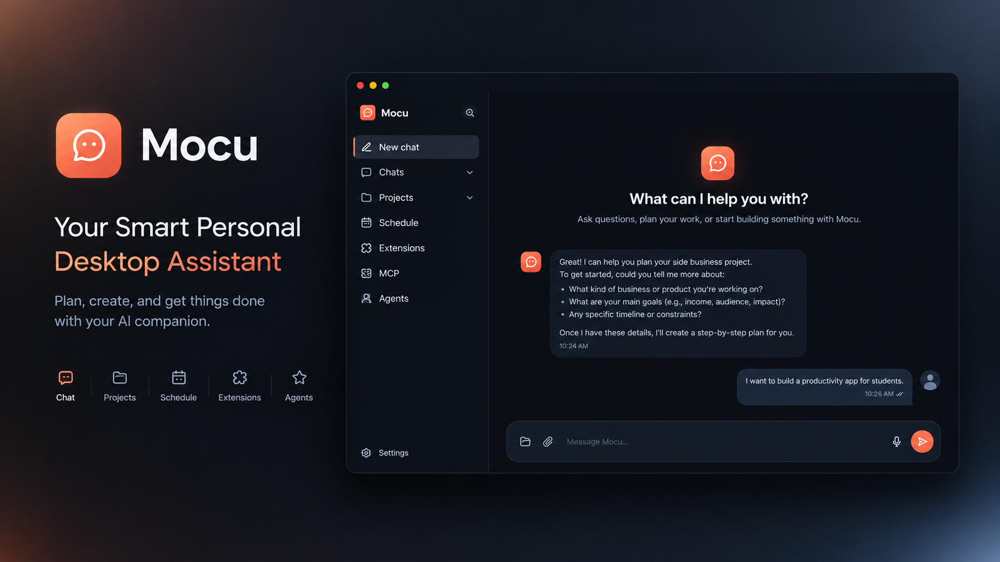

# Mocu — Your Smart Personal Desktop Assistant

<p align="center">
  
</p>

<p align="center">
  
  
  
</p>

**Mocu** is a personal AI desktop assistant built with **Tauri 2** — a Rust backend paired with a React + TypeScript frontend. It combines chat, projects, scheduling, memory, a multi-agent system, skills, a full extension system, and MCP (Model Context Protocol) support into a single native desktop app for Windows, macOS, and Linux.

Mocu is **model-agnostic**: bring your own API key from any OpenAI-compatible provider and configure models per tier (cheap / medium / expensive) in Settings.

---

## ⚠️ Disclaimer (Please Read)

> **Project Status: Early Alpha — Unstable**

Mocu is in an **early stage of development** and is not yet stable. Due to potential bugs and unfinished features, **it is not recommended for daily use at this time**. Expect significant changes, breaking updates, and frequent iteration. This version is intended for testing, feedback, and observation only. Use at your own risk.

---

## ✨ Features

### Core
- 💬 **Chat** — Full-featured chat with markdown rendering, code highlighting, chat history, and live tool-activity feeds.
- 🎯 **Focus** — Start a goal directly, work in flexible user-controlled sections, and carry forward concise section memories without loading global memory or a generated plan. Say “Focus on …” to begin, “next section” to move on, and “end Focus” to return to normal chat.
- 📁 **Projects** — Organize work into projects with their own chat history and **project memory** (episodes, turns, and retrieval).
- 📅 **Schedule** — Set and manage schedules and tasks, with a built-in scheduler and schedule tools available to the AI.
- 🧠 **Memory** — Layered memory system: short-term conversation memory, long-term personal memory (atomic memory extraction, relationship analysis, memory evolution), and project-level memory. Mocu remembers context across sessions.
- 🎯 **Jev Decision Model** — A built-in probabilistic decision model the agent (and extensions) can query for typed choices and scores.

### Agent & Extensibility
- 🤖 **Agents** — Create custom agents from a natural-language description; Mocu parses them into structured definitions (tools, skills, sub-agents, extensions, model) that you can invoke from chat with `/agent`.
- 🛠️ **Skills** — Write reusable skills as markdown files; the agent loads them on demand via a skill loader tool. Create and edit skills directly in the app.
- 🧩 **Extension System** — Install extensions as ZIP files from the Extensions page. Extensions are independent **Node.js or Python** programs that talk to the Mocu host over **JSON-RPC 2.0 (stdin/stdout)**, are spawned lazily on first use, and expose commands that become callable agent tools. Extensions can call back into Mocu's LLM, the Jev decision model, the embedding model, and stream live progress into the chat.
- 🔌 **MCP Host** — Connect external MCP servers (stdio, Streamable HTTP, or legacy HTTP+SSE transports) and import them in the common `mcpServers` JSON format. Their tools are exposed to Mocu's agents through the same tool pipeline as native tools.

### Built-in Agent Tools
- 🌐 **Web Search** — Internet search via the Perplexity API (bring your own Perplexity key).
- 👁️ **Desktop Vision** — Capture and analyze your screen.
- 💻 **Terminal Execution** — Run OS commands through the terminal.
- 📂 **Filesystem Tools** — File management and folder operations.
- 🧱 **Agent Builder** — Mocu can create and manage new agents for you from within a conversation.

---

## 🏗️ Architecture

| Layer | Technology | Location |
|-------|------------|----------|
| Desktop shell & native capabilities (windows, tray, screenshots, input, process spawning) | Rust / Tauri 2 | `src-tauri/` (incl. `src-tauri/src/extension_host/` and MCP stdio bridge) |
| Frontend UI | React 19 + TypeScript + Vite + Tailwind CSS | `src/` |
| AI orchestration | LangChain / LangGraph | `src/services/ai/` |
| Chat, agents, skills, memory | TypeScript | `src/chat/` |
| Extension runtime & UI | TypeScript | `src/extensions/` |
| MCP client | TypeScript | `src/mcp/` |
| Extension SDKs & shared contracts | Node.js (`@mocu/extension-sdk`) and Python (`mocu_extension_sdk`) | `extension-system/` |

**Extension system in short:** the Rust host keeps a registry of installed extensions (from their `manifest.json`), spawns the extension process lazily when a command runs, routes JSON-RPC requests, and enforces per-command timeouts. The frontend handles installation, settings forms, and exposes each extension command as an agent tool (e.g. `extension_pi_node_ask`). Full documentation lives in [`docs/extention/`](docs/extention/README.md).

**Example extensions** in [`extensions-examples/`](extensions-examples/): `time-node` (hello world), `sysinfo-node` (system info), `hi-llm-node` (first LLM call), `llm-outside-example`, `pi-node` (advanced: multi-command coding-agent session with streaming activity), and `test` (bare protocol, no SDK).

---

## 📋 Prerequisites

Building and running Mocu from source requires:

| Requirement | Needed for | Notes |
|-------------|-----------|-------|
| **Rust** (stable, with `rustup`) | Building the Tauri/Rust backend (`src-tauri/`) | Install the OS prerequisites for [Tauri 2](https://tauri.app/start/prerequisites/) for your platform. |
| **Node.js** (LTS, includes npm) | Building the frontend, the dev server, and running **Node.js extensions** | Node extensions are the most common extension runtime; the installer runs `npm install` for them automatically. |
| **Python** (optional) | Running **Python extensions** | Only needed if you use Python-based extensions (the SDK is in `extension-system/sdk-python/`). Mocu does **not** run `pip install` for you — manage Python extension dependencies yourself. |
| **AI provider API key** | All AI features | Any **OpenAI-compatible** endpoint; configure base URL, model names, and API key in Mocu's Settings. |
| **Perplexity API key** (optional) | Web search tool | Configure in Settings. |

### Installing the toolchain

**Windows (PowerShell):**

```powershell
# Rust (installs rustup + stable toolchain)
winget install --id Rustlang.Rustup -e
# If rustup is already present, update the toolchain instead:
# rustup update stable

# Node.js LTS
winget install --id OpenJS.NodeJS.LTS -e

# Python (only needed for Python extensions)
winget install --id Python.Python.3.12 -e

# Microsoft C++ Build Tools are required to compile Rust on Windows:
# https://tauri.app/start/prerequisites/
```

**macOS:**

```bash
# Xcode Command Line Tools (Rust prerequisite)
xcode-select --install

# Rust
curl --proto '=https' --tlsv1.2 -sSf https://sh.rustup.rs | sh

# Node.js and Python (optional) via Homebrew
brew install node
brew install python   # only needed for Python extensions
```

**Linux (Debian/Ubuntu):**

```bash
# Rust
curl --proto '=https' --tlsv1.2 -sSf https://sh.rustup.rs | sh

# Node.js and Python
sudo apt update
sudo apt install -y nodejs npm python3 python3-pip

# Tauri system dependencies (see Tauri docs for your distro):
sudo apt install -y libwebkit2gtk-4.1-dev build-essential curl wget file \
  libxdo-dev libssl-dev libayatana-appindicator3-dev librsvg2-dev
```

---

## 🚀 Getting Started

Clone the repository, then from the project root:

```bash
# 1. Install frontend dependencies
npm install

# 2. Run Mocu in development mode
#    (starts the Vite dev server on port 1431, then launches the Tauri desktop app)
npm run tauri dev

# 3. Build an installable package for your operating system
npm run tauri build
```

### First run

1. Open **Settings** and configure your AI provider (API key, base URL, and model names for the cheap/medium/expensive tiers).
2. Optionally add a Perplexity API key for web search.
3. Import MCP servers from the **MCP** page (paste a `mcpServers` JSON document), install extensions from the **Extensions** page, and create agents or skills from their pages.

### Other scripts

| Command | Description |
|---------|-------------|
| `npm run dev` | Frontend only — Vite dev server on port `1431`. |
| `npm run build` | Type-check (`tsc`) and build the production frontend bundle. |
| `npm run preview` | Preview the production frontend build. |
| `npm test` | Run the Vitest test suite. |
| `npm run tauri dev` | Run the full desktop app in development mode. |
| `npm run tauri build` | Build the bundled desktop application. |

---

## 🧩 Building an Extension (Quick Start)

An extension is a folder with a `manifest.json` and an entry file. Minimal Node.js example:

```js
// index.js
import { createExtension } from "@mocu/extension-sdk";

const extension = createExtension({
  commands: {
    hello(input) {
      return `Hello, ${input?.name ?? "world"}!`;
    },
  },
});

extension.start();
```

```json
// manifest.json
{
  "id": "com.example.hello",
  "name": "Hello Extension",
  "description": "Says hello.",
  "version": "1.0.0",
  "runtime": "node",
  "entry": "index.js",
  "commands": [
    { "id": "hello", "title": "Say hello", "description": "Greets the caller." }
  ]
}
```

Zip the folder (with `manifest.json` inside) and install it from Mocu's **Extensions** page. Node extensions get `npm install` run automatically; Python extensions use `mocu_extension_sdk` and manage their own dependencies.

📖 Full documentation: [`docs/extention/README.md`](docs/extention/README.md) — architecture, manifest reference, Node & Python SDKs, LLM/decision/embedding host APIs, streaming activity, installation, protocol reference, and an AI-agent authoring guide. MCP details: [`docs/mcp.md`](docs/mcp.md).

---

## 📄 License

Licensed under the [Apache License 2.0](LICENSE).

---

<p align="center">
  Built with ❤️ — under active development
</p>
